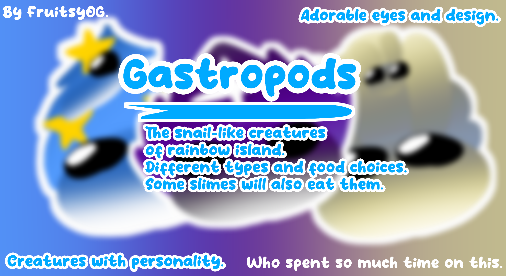

# Gastropods

The snail-like creatures of Rainbow Island. Different types and food choices. Some slimes will also eat them.

Creatures with personality. Adorable eyes and design.

## About

Gastropods is a mod that adds in new creatures called the "Gastropods". Gastropods are based on real-life sea snails and some have the abilities of them. While they're not actual gastropods, they share similarities.
With their queens, kings they reproduce. Some do not and simply live on their own.

Lets get into ~~everything that~~ what is provided in this mod!

## Gastropods

Gastropods are as has already been said, the newly added creatures that are found on rainbow island. Gastropods identify as meat and will be eaten by slimes.

Here are some facts:
- Slimes that eat meat will eat gastropods.
- Slimes are afraid of defensive gastropods but will still go in to eat them if they can. (This may end badly)
- Angler slimes favor all gastropods but are not afraid of them whatsoever.
- When gastropods are spawned from reproduction, they have a 50% chance of following a queen nearby or a 30% chance of following a king nearby. Regardless of who spawned them. They could also just not follow anybody.

With these facts, you should know enough about gastropods in general! But there is much more to explain and learn.

**If you would like to learn more, please go to the Slimepedia entries in the mod itself as this readme is not to be updated much. Though you can still [read the old readme here](OLD_README.md)!**