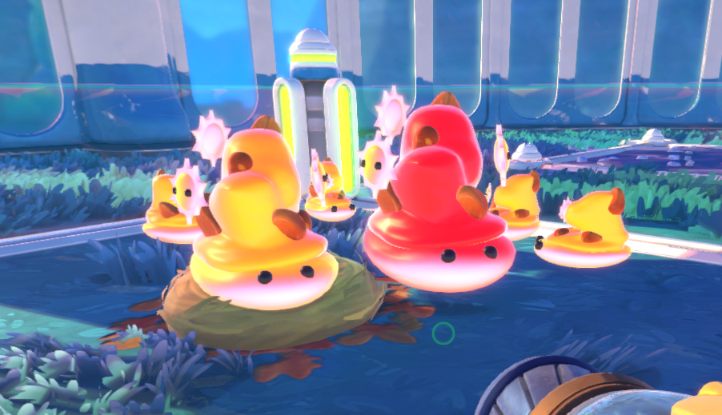
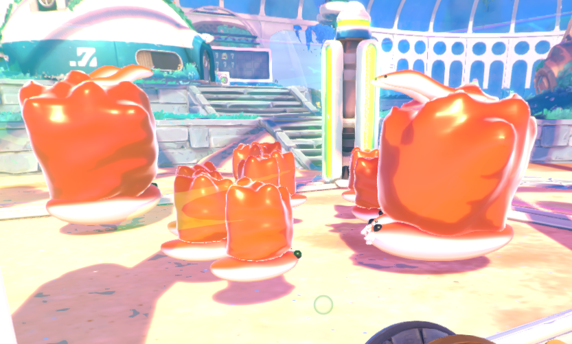

# Gastropods

The snail-like creatures of Rainbow Island. Different types and food choices. Some slimes will also eat them.

Creatures with personality. Adorable eyes and design.

## About

Gastropods is a mod that adds in new creatures called the "Gastropods". Gastropods are based on real-life sea snails and some have the abilities of them. While they're not actual gastropods, they share similarities.
With their queens, kings they reproduce. Some do not and simply live on their own.

Lets get into everything that is provided in this mod!

## Gastropods

Gastropods are as has already been said, the newly added creatures that are found on rainbow island. Gastropods identify as meat and will be eaten by slimes.

Here are some facts:
- Slimes that eat meat will eat gastropods.
- Slimes are afraid of defensive gastropods but will still go in to eat them if they can.
- Angler slimes favor all gastropods but are not afraid of them whatsoever.
- When gastropods are spawned from reproduction, they have a 50% chance of following a queen nearby or a 30% chance of following a king nearby. Regardless of who spawned them. They could also just not follow anybody.

With these facts, you should know enough about gastropods in general! But there is much more to explain.

## Where to find Gastropods

Gastropods do not spawn, most of them. Gastropods are usually reproduced via **Queens** and **Kings** that spawn freely on rainbow island within their selected habitat.
Some Gastropods don't have Queens or Kings and will spawn on their own but these may be defensive in some kind of way, so keep that in mind.

I will list all the spawn locations soon.

### Kings & Queens

Kings & Queens in this mod are very important. Its your only source of getting gastropods if they do not spawn on their own which if they did, you cannot have them reproduced.

Here are some facts:
- Queens will not move whatsoever. For them to move, they must be fed a selected food (Only last for up to 3 hours in-game). This will be mentioned soon.
- Kings will move but eventually have a "lazy" mode. They will not move at all and you cannot change this. They usually stop within a little over an hour in-game.
- Queens will search for a King every now and then. I will not specify as it can be randomized but once they've found their king (must be close enough / nearby) they will begin the time they need to spawn a gastropod of their corresponding type. Kings do not search whatsoever.
- You require a queen and a king of the same type for reproduction, it will not work any other way.
- The reproduction time is randomized so it cannot be specified but every now and then within the interval, they will spawn a gastropod fo their corresponding type nearby.

With these facts, you should know enough about king & queen gastropods in general! But there is much more that could come to them but this is overall what you need to know.

### Spawning on their own

Gastropods that spawn on their own cannot reproduce whatsoever because they're not queens or kings and instead just a singular gastropod of one type.
Although most of these gastropods may be defensive in some kind of way.

Here are some facts:
- Defensive gastropods are not against you. (As of now) They're usually against slimes and they could harm them, this is to be taken into consideration when keeping them and feeding them to your slimes.
- Gastropods that spawn on their own may have a higher chance of spawning than a queen or king gastropod.
- Rare gastropods are more likely to be gastropods that spawn on their own. These will be listed later.

With these facts, you should know enough about gastropods that spawn on their own! There could be much more to know though.

## Type of Attackers

Here I will list the type of attackers that you may find in this mod. These are defensive gastropod abilities.

- Harpoon Attacker. (Similar to the Cone Snail, they will shoot harpoons and one shot slimes until they've ran out of harpoons.)
- Hungry Attacker. (Not similar to anything I assume, they will eat any slime that touches them until they're full.)

These are the current attackers supported in the mod. Although some are only used for certain gastropod types while others may be supported by multiple types.

## Type of Gastropods

What you've probably wanted to know, I will give images of them later but for now this will list ALL the gastropod types in-game without any description to them. + Spawn Locations

- Brine | Queen & King | Rainbow Fields (+ Pink Canyon in Starlight Strand where Angler Slimes spawn)
- Sunlight | Queen & King | Starlight Strand
- Primal | Queen & King | Ember Valley
- Powder | Queen & King | Powderfall Bluffs (+ Occasionally in Rainbow Fields)
- Toxin | On Their Own | Everywhere but Powderfall Bluffs
- Unidentified | On Their Own | Everywhere

## Gastropods with Abilities

Here are some gastropods that have abilities and if they're defensive or not.

- Toxin | Harpoon Attacker | Defensive
- Primal | Hungry Attacker | Defensive
- Unidentified | Bounces actors (food, slimes, etc) away when touched | Defensive (could launch one off the map tbh if close enough)

Some of these that were mentioned will be explained later.

# Confidants

This is yet to be shared due to them not being in the mod yet.

# Ending it off with images / small descriptions of gastropods.

Some of these things you'll just need to learn from experience with using the mod! This README will be updated with newly added gastropods as this mod is currently a work-in-progress and is hopefully to have more content added in the future! If you use this mod and enjoy it, thanks for playing and I'm glad you enjoyed it. :]

### Brine

Brine is the first gastropod to be created in the mod and is probably one of the most normal of them all. They have a fish confidant.

### Sunlight

Sunlight is the second gastropod to be created in the mod and is also one of the most normal of them all. They have a sun confidant.

### Toxin

Toxin is the third gastropod to be created in the mod and the first defensive one. They do not have a confidant but you could say their harpoon is their confidant.

### Primal

Primal is the fourth gastropod to be created in the mod and the second defensive one. They have a snake confidant.

### Powder

Powder is the fifth gastropod to be created in the mod and the first to have kings & queens that do not have more than one confidant. They have a snowball confidant.

### Unidentified

Unidentified gastropods will bounce around and move a lot making them hard to feed. They cannot be vacced but you can throw a **craft** item at them and they'll transform randomly into a rare item in the mod (including Moondew Nectar as extra) or a rare slime in the game. (Lucky & Gold) (They're also the sixith gastropod)

